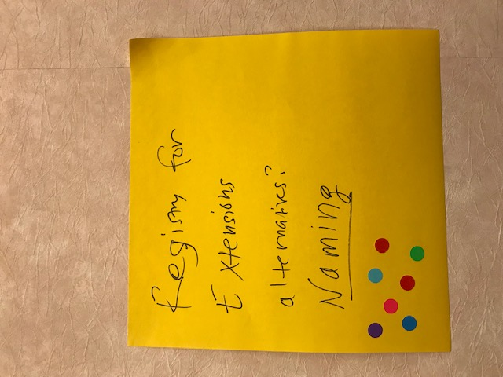

# Gluecon Unconference 2019

On May 21st the OpenAPI TSC held an unconference in Broomfield, CO, prior to Gluecon 2019.

## List of Attendees TBD

## Discussed Topics
Various topics were proposed and voted on, here are the top 3 we discussed:

1. Registry for Extensions

2. Query Protocols as a Language Feature
3. Engaging Implementors & Tool Providers to Drive OpenAPI Evolution
4. Schema Roadmap - brief discussion

## Topics Proposed but Not Discussed

List TBD
